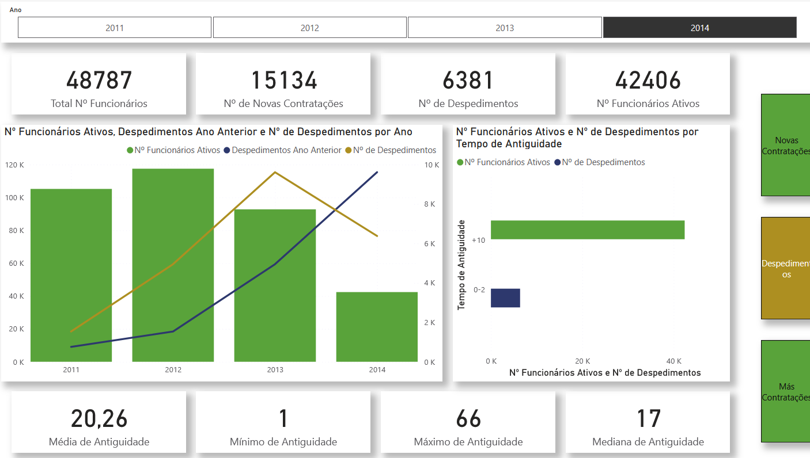
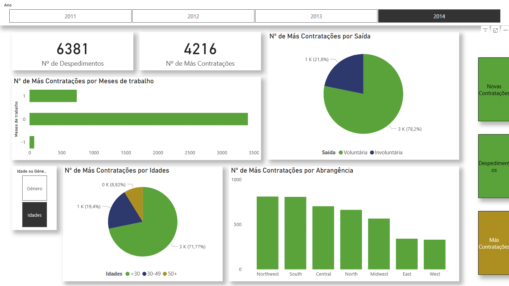
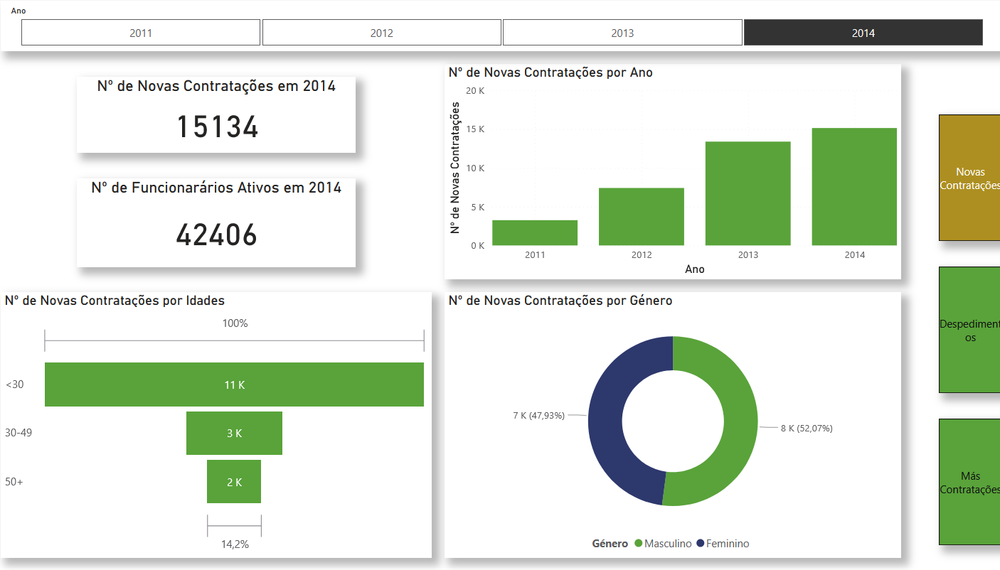

# 📊 HR Dashboard – Employee Hires, Terminations & Turnover Analysis

This Power BI report provides a historical overview of key Human Resources metrics between 2011 and 2014. It focuses on employee lifecycle indicators such as hires, dismissals, involuntary terminations, and bad hires – supporting HR departments in identifying trends and making informed decisions.

---

## 📌 Key Highlights

- 📅 **Active Employees per Year**
- 👥 **New Hires vs Terminations** (Yearly)
- ❌ **Voluntary vs Involuntary Terminations**
- 📉 **Turnover by Age Group, Tenure, Region**
- ⚠️ **Bad Hires**: new employees who left within 1 month
- 🧭 **Seniority Overview**: Avg, Median, Min, Max tenure per year

---

## 📷 Dashboard Previews

### 1. Active Employees, Terminations & Tenure Overview  

---

### 2. Bad Hires by Time, Exit Reason, Age & Region  

---

### 3. New Hires by Age and Gender  

---

## 🧩 Data Model

This project uses a fictional dataset created for educational purposes, simulating a medium-sized company's HR records from 2011 to 2014. The database includes:

- Employee demographics  
- Hire and termination dates  
- Termination types and reasons  
- Region and department info  
- Tenure duration calculations  

---

## 💡 Technical Details

- Built using **Power BI Desktop**
- DAX measures for:
  - Turnover Rate
  - Monthly hires and exits
  - Detection of Bad Hires (≤1 month)
  - Tenure metrics: average, median, min, max
- Filtered views by **Year**, **Age Group**, **Region**, and **Termination Type**
- Visuals organized by themes and user experience (UX) in mind
- Color-coded categories for easy interpretation (e.g. green = active, red = dismissals)

---

## ✅ What I Learned

- Building HR-focused KPIs and metrics in Power BI  
- Creating interactive dashboards that tell a clear story  
- Using calculated columns and measures for time intelligence  
- Designing dashboards with clean, readable visuals and thematic layouts  

---

## 🔗 About the Author

Hi! I'm a BI student passionate about data visualization and storytelling. This is part of my Power BI portfolio, created to practice dashboard design and share my learning journey.  
📬 [Let’s connect!](https://www.linkedin.com/in/suse-andrade/)

